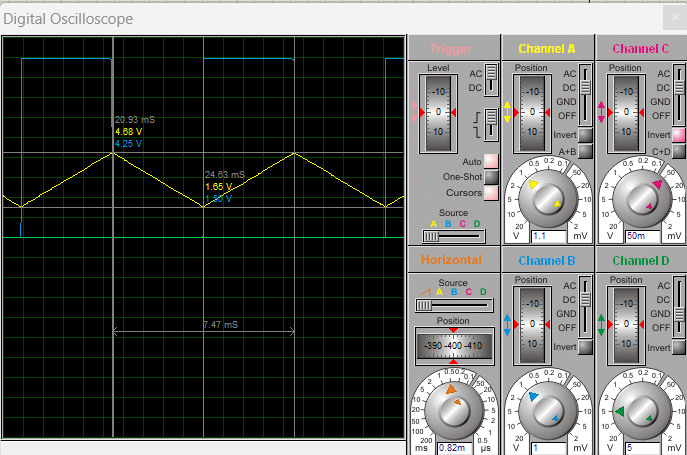

# Análise 03 — Multivibradores com AmpOp

**Curso:** Tecnologia em Eletrônica Industrial / Engenharia Eletrônica  
**Unidade:** Eletrônica III  
**Professor:** Luis Carlos Martinhago Schlichting

---

## Objetivo

Analisar, simular e montar circuitos multivibradores baseados em amplificadores operacionais, determinando os limiares de transição, equações de frequência e o comportamento das saídas em função da tensão de controle Vco.

---

## 1. Circuito Multivibrador LM324

### 1.1 Esquemático

### 1.2 Parâmetros do circuito

| Componente | Valor |
|------------|-------|
| R1 | 100 kΩ |
| R2 | 51 kΩ |
| R3 | 51 kΩ |
| R4 | 51 kΩ |
| R5 | 10 kΩ |
| R6 | 100 kΩ |
| R7 | 50 kΩ |
| C1 | 0,05 µF |
| Q1 | BC547 |
| SW1 | SW-SPST |
| V1 | 10 V |
| V2 | 2,5 V |
| Vco | 6 V |
| U1:A, U1:B | LM324 |

### 1.3 Análise de Funcionamento

#### 1.3.1 Diagrama de blocos

O circuito opera como **oscilador** em malha fechada: o integrador (U1:B) gera a rampa, o comparador (U1:A) detecta os limiares e gera a onda quadrada, e Q1 reseta o integrador a cada ciclo.

---

#### 1.3.2 Comparador U1:A (Schmitt Trigger)

U1:A é um **Schmitt Trigger** — comparador com realimentação positiva via R3 e R6. Dois limiares distintos são criados: quando a rampa (Saída 2) sobe e cruza $V_{TH}$, a Saída 1 vai a nível baixo; quando desce e cruza $V_{TL}$, volta a nível alto.

Pela superposição na entrada (+) de U1:A:

$$V_+ = V_2 \cdot \frac{R_6}{R_3 + R_6} + V_{out1} \cdot \frac{R_3}{R_3 + R_6}$$

##### Equações genéricas

$$V_{TH} = V_2 \cdot \frac{R_6}{R_3 + R_6} + V_{sat+} \cdot \frac{R_3}{R_3 + R_6}$$

$$V_{TL} = V_2 \cdot \frac{R_6}{R_3 + R_6} + V_{sat-} \cdot \frac{R_3}{R_3 + R_6}$$

##### Cálculo numérico

LM324 com alimentação única V1 = 10 V: $V_{sat+} \approx 8{,}9$ V e $V_{sat-} \approx 0$ V

$$V_{TH} = 2{,}5 \cdot \frac{100k}{151k} + 8{,}9 \cdot \frac{51k}{151k} = 1{,}66 + 3{,}01 = 4{,}67 \text{ V}$$

$$V_{TL} = 2{,}5 \cdot \frac{100k}{151k} + 0 = 1{,}66 \text{ V}$$

$$\Delta V = V_{TH} - V_{TL} = 3{,}01 \text{ V}$$
---

#### 1.3.3 Integrador U1:B

U1:B está configurado como **integrador inversor** — C1 no caminho de realimentação. Com resistor no feedback o AmpOp seria um amplificador simples; com capacitor, a saída é a integral da entrada no tempo.

R4 (51 kΩ) vem de Vco e R2 (51 kΩ) vai para GND, formando um divisor **simétrico** na entrada (+) de U1:B. V1 (10 V) alimenta apenas o pino 4 do LM324, não entra no divisor.

$$V^+ = V_{co} \cdot \frac{R_2}{R_2 + R_4} = \frac{V_{co}}{2} = \frac{6}{2} = 3{,}0 \text{ V}$$

Pelo curto-circuito virtual, $V^- = V^+ = 3{,}0$ V. A corrente em R1 é:

$$I = \frac{V_{co} - V^+}{R_1} = \frac{6 - 3}{100k} = 30 \ \mu\text{A}$$

Essa corrente constante em C1 produz rampa linear com inclinação:

$$\frac{dV_{out}}{dt} = \frac{I}{C_1} = \frac{30 \ \mu}{0{,}05 \ \mu} = 600 \text{ V/s} = 0{,}6 \text{ V/ms}$$
---

#### 1.3.4 Chave Q1 e análise por estados

A chave Q1 não descarrega C1 diretamente — ela **desgarrega corrente no nó V⁻ de U1:B**, invertendo o sentido da integração. Para entender isso, analisamos o circuito em quatro estados.

##### 1.3.4.1 — Carga (Q1 cortado)

Com Q1 cortado, o nó V⁻ de U1:B está em curto virtual com V⁺ = 3 V. A única corrente que chega ao nó vem de R1:

$$I_{carga} = \frac{V_{co} - V^+}{R_1} = \frac{6 - 3}{100k} = 30 \ \mu\text{A}$$

Essa corrente carrega C1, fazendo a **Saída 2 subir**:

$$\frac{dV_{out}}{dt} = +\frac{I_{carga}}{C_1} = +600 \text{ V/s}$$

Saída 1 permanece em nível baixo (Vsat_lo = 0 V) — a base de Q1 não recebe tensão suficiente via R5.

##### 1.3.4.2 Descarga (Q1 saturado)

Com Q1 saturado, o coletor vai a ≈ 0 V, e R7 (50 kΩ) passa a **drenar** corrente do nó V⁻:

$$I_{R7} = \frac{V^+}{R_7} = \frac{3}{50k} = 60 \ \mu\text{A}$$

R1 continua fornecendo 30 µA, mas R7 drena 60 µA — o déficit de 30 µA é suprido pelo próprio capacitor, fazendo a **Saída 2 descer**:

$$\frac{dV_{out}}{dt} = -\frac{I_{R7} - I_{carga}}{C_1} = -\frac{60 - 30}{C_1} \cdot 10^{-6} = -600 \text{ V/s}$$

A taxa de descarga é **idêntica em módulo** à taxa de carga — o que explica por que a Saída 2 é uma **onda triangular simétrica**.

##### 1.3.4.3 Disparo em V_TH

Quando a Saída 2 atinge $V_{TH}$, U1:A comuta: Saída 1 vai a nível alto ($V_{sat+}$ ≈ 8,9 V). Essa tensão chega à base de Q1 via R5 (10 kΩ) e o satura.

##### 1.3.4.4 Disparo em V_TL

Quando a Saída 2 atinge $V_{TL}$, U1:A comuta de volta: Saída 1 vai a nível baixo, Q1 corta, e o ciclo recomeça.

---

### 1.4 Equação da Frequência

#### 1.4.1 Equações genéricas

O período é a soma do tempo de carga (Q1 cortado) e do tempo de descarga (Q1 saturado):

$$T = T_{carga} + T_{descarga}$$

A corrente de carga, com $V^+ = V_{co} \cdot \dfrac{R_2}{R_2+R_4} = V_{co}/2$ (pois R2 = R4):

$$I_{carga} = \frac{V_{co} - V^+}{R_1} = \frac{V_{co}}{2 R_1}$$

A corrente de descarga, quando Q1 satura e R7 drena o nó V⁻:

$$I_{descarga} = \left|\frac{V^+}{R_7} - I_{carga}\right| = \left|\frac{V_{co}}{2 R_7} - \frac{V_{co}}{2 R_1}\right|$$

$$T_{carga} = \frac{\Delta V \cdot C_1}{I_{carga}} \qquad T_{descarga} = \frac{\Delta V \cdot C_1}{I_{descarga}}$$

$$f = \frac{1}{T_{carga} + T_{descarga}}$$

#### Cálculo numérico (Vco = 6 V)

$$V^+ = \frac{V_{co}}{2} = 3{,}0 \text{ V}$$

$$I_{carga} = \frac{6 - 3}{100k} = 30 \ \mu\text{A}$$

$$I_{descarga} = \left|\frac{3}{50k} - 30\mu\right| = |60\mu - 30\mu| = 30 \ \mu\text{A}$$

Como $I_{carga} = I_{descarga} = 30\ \mu A$, a onda é **triangular simétrica**:

$$T_{carga} = T_{descarga} = \frac{3{,}01 \times 0{,}05\mu}{30\mu} = 5{,}02 \text{ ms}$$

$$T = 5{,}02 + 5{,}02 = 10{,}03 \text{ ms} \quad \Rightarrow \quad f = 99{,}7 \text{ Hz}$$

*Cursor 1: V_TH = 4,68 V · Cursor 2: V_TL = 1,65 V*

*Canal azul: Saída 1 (onda quadrada). Canal amarelo: Saída 2 (rampa). T = 9,96 ms.*

#### Cálculo numérico (Vco = 8 V)

$$V^+ = \frac{V_{co}}{2} = 4{,}0 \text{ V}$$

$$I_{carga} = \frac{8 - 4}{100k} = 40 \ \mu\text{A}$$

$$I_{descarga} = \left|\frac{4}{50k} - 40\mu\right| = |80\mu - 40\mu| = 40 \ \mu\text{A}$$

Como $I_{carga} = I_{descarga} = 40\ \mu A$, a onda é **triangular simétrica**:

$$T_{carga} = T_{descarga} = \frac{3{,}01 \times 0{,}05\mu}{40\mu} = 3{,}76 \text{ ms}$$

$$T = 3{,}76 + 3{,}76 = 7{,}52 \text{ ms} \quad \Rightarrow \quad f = 133{,}0 \text{ Hz}$$

*Canal azul: Saída 1 (onda quadrada). Canal amarelo: Saída 2 (rampa). T = 7,47 ms.*

####  Comparação — Frequência, Período e Limiar

| Grandeza | Teórico | Simulado | Montagem | Desvio T×S |
|----------|:-------:|:--------:|:--------:|:----------:|
| T_carga | 5,02 ms | ≈ 4,98 ms | ___ | −0,8% |
| T_descarga | 5,02 ms | ≈ 4,98 ms | ___ | −0,8% |
| T total | 10,03 ms | 9,96 ms | ___ | −0,7% |
| f | 99,7 Hz | 100,4 Hz | ___ | +0,7% |
| V_TH | 4,67 V | 4,68 V | ___ | +0,2% |
| V_TL | 1,66 V | 1,65 V | ___ | −0,3% |
| ΔV | 3,01 V | 3,03 V | ___ | +0,7% |

> **Sobre o desvio de frequência:** o modelo teórico de carga/descarga simétrica concorda excelentemente com o simulado (desvio de apenas ±0,8%). O pequeno desvio residual deve-se ao modelo SPICE do LM324 — corrente de bias (~45 nA), tensão de offset (~±7 mV) e tempo de resposta finito do comparador. Os limiares V_TH e V_TL também concordam excelentemente (< 1%), confirmando a validade das equações do Schmitt Trigger.

---
### 1.5 Influência de Vco na Frequência

Como $V^+ = V_{co}/2$, a corrente de carga $I_{carga} = V_{co}/(2R_1)$ e a corrente de descarga $I_{descarga} = |V_{co}/(2R_7) - V_{co}/(2R_1)|$ escalam **igualmente** com Vco — por isso $T_{carga} = T_{descarga}$ para qualquer valor de Vco, e a onda é sempre triangular simétrica:

$$f(V_{co}) = \frac{V_{co}}{2 \cdot \Delta V \cdot C_1} \cdot \frac{1}{R_1}$$

| Vco (V) | I_carga = I_desc (µA) | T_carga = T_desc (ms) | f (Hz) |
|:-------:|:----------------------:|:----------------------:|:------:|
| 1 | 5 | 30,10 | 17 |
| 2 | 10 | 15,05 | 33 |
| 3 | 15 | 10,03 | 50 |
| 4 | 20 | 7,53 | 66 |
| 6 | 30 | 5,02 | **100** |
| 8 | 40 | 3,76 | 133 |
| 10 | 50 | 3,01 | 166 |

O circuito funciona como **VCO (Voltage Controlled Oscillator)** com resposta **linear**: f é diretamente proporcional a Vco, e a forma de onda da Saída 2 permanece triangular simétrica em toda a faixa.

---

### 1.6 Vco com Sinal Variável

Quando se aplica um sinal variável em Vco, a corrente de integração $I = V_{co}/(2R_1)$ varia instantaneamente, fazendo a frequência de oscilação acompanhar o sinal:

- **Vco senoidal** → frequência da Saída 1 varia senoidalmente em torno de f₀ — modulação em frequência (FM)
- **Vco triangular** → frequência varia linearmente no tempo — chirp linear

Este é o princípio de funcionamento de VCOs analógicos em PLLs (Phase-Locked Loops).

> 📷 `[INSERIR: imgs/simulacao/q2_vco_senoidal.png]`

---
## Conclusão
---

## Referências

- Datasheet LM324 — Texas Instruments
- Datasheet TL082 — Texas Instruments
- Datasheet BC547 / BC548 — Fairchild Semiconductor
- SEDRA, A. S.; SMITH, K. C. *Microeletrônica*. 7ª ed. Pearson, 2015.
- Simulação: Proteus 8 Professional

---

*Equações em LaTeX, gráficos em Python/Matplotlib.*
