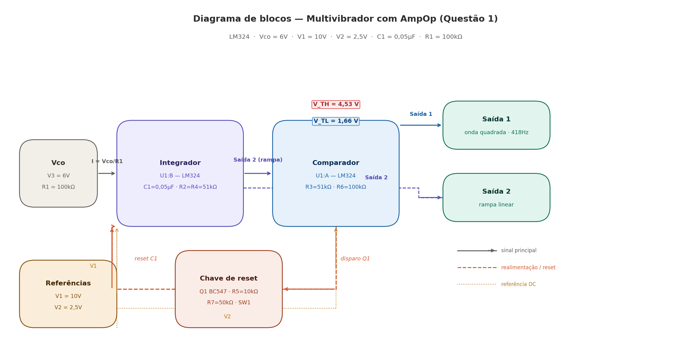
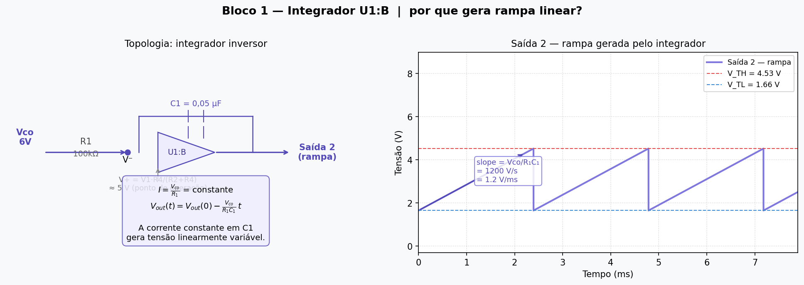
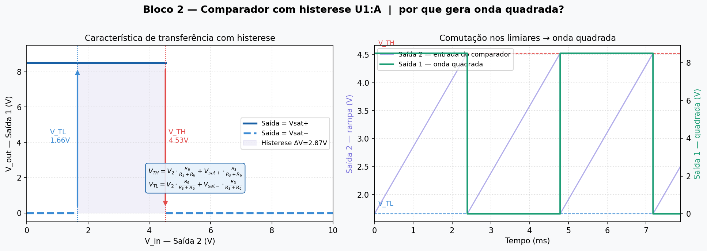
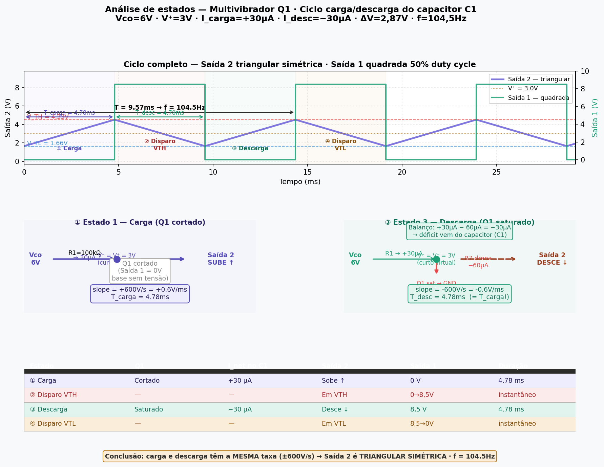
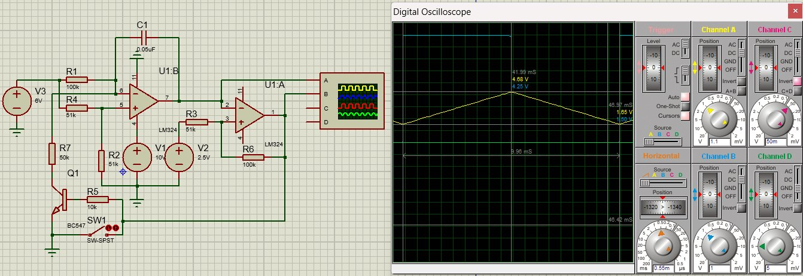
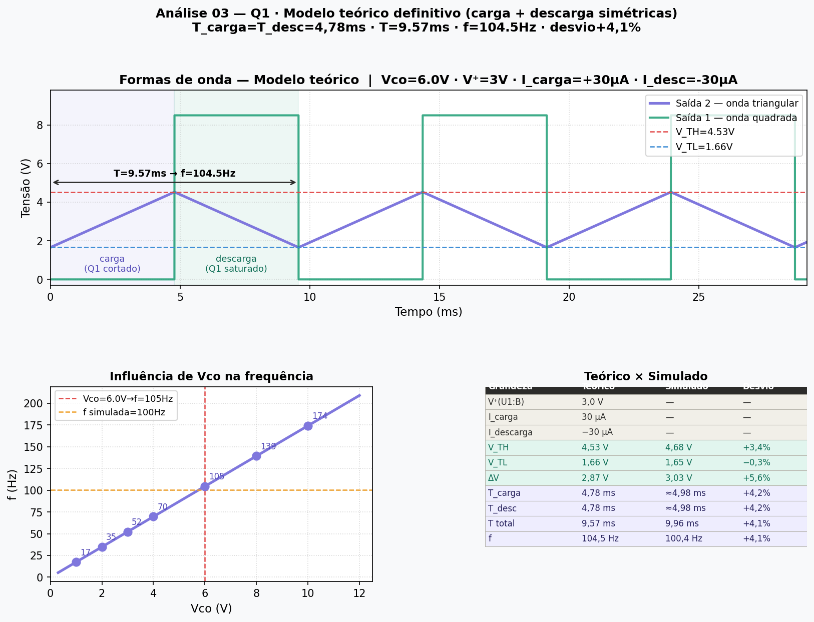
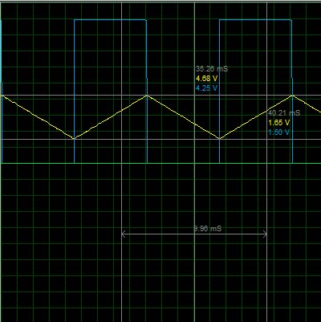
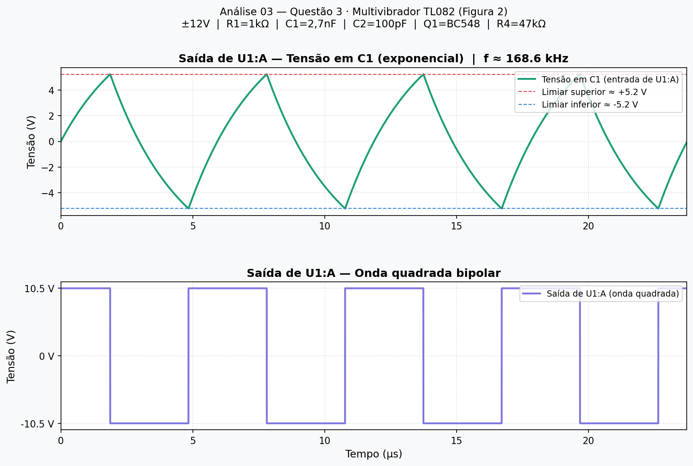

# Análise 03 — Multivibradores com AmpOp

**Curso:** Tecnologia em Eletrônica Industrial / Engenharia Eletrônica  
**Unidade:** Eletrônica III  
**Professor:** Luis Carlos Martinhago Schlichting

---

## 1. Objetivo

Analisar, simular e montar circuitos multivibradores baseados em amplificadores operacionais, determinando os limiares de transição, equações de frequência e o comportamento das saídas em função da tensão de controle Vco.

---

## 2. Questão 1 — Circuito Multivibrador LM324

### 2.1 Esquemático

### 2.2 Parâmetros do circuito

| Componente | Valor | Função |
|------------|-------|--------|
| R1 | 100 kΩ | Converte Vco em corrente para o integrador |
| R2 | 51 kΩ | Divisor da entrada (+) de U1:B — ligado ao GND |
| R3 | 51 kΩ | Divisor de histerese do comparador U1:A |
| R4 | 51 kΩ | Divisor da entrada (+) de U1:B — ligado a Vco |
| R5 | 10 kΩ | Resistor de base de Q1 (vem da Saída 1) |
| R6 | 100 kΩ | Divisor de histerese do comparador U1:A |
| R7 | 50 kΩ | Liga coletor de Q1 ao nó V⁻ de U1:B |
| C1 | 0,05 µF | Capacitor integrador — gera a rampa |
| Q1 | BC547 | Transistor NPN — puxa V⁻ de U1:B para GND via R7 |
| SW1 | SW-SPST | Impulso inicial para desencadear a oscilação |
| V1 | 10 V | Alimentação do LM324 (pino 4) |
| V2 | 2,5 V | Referência central do comparador U1:A |
| Vco | 6 V | Tensão de controle da frequência |
| U1:A, U1:B | LM324 | Amplificadores operacionais |

---

## 3. Análise de Funcionamento

### 3.1 Diagrama de blocos

O circuito opera como **oscilador de relaxação** em malha fechada: o integrador (U1:B) gera a rampa, o comparador (U1:A) detecta os limiares e gera a onda quadrada, e Q1 reseta o integrador a cada ciclo.

---

### 3.2 Bloco 1 — Integrador U1:B

U1:B está configurado como **integrador inversor** — C1 no caminho de realimentação. Com resistor no feedback o AmpOp seria um amplificador simples; com capacitor, a saída é a integral da entrada no tempo.

R4 (51 kΩ) vem de Vco e R2 (51 kΩ) vai para GND, formando um divisor **simétrico** na entrada (+) de U1:B. V1 (10 V) alimenta apenas o pino 4 do LM324, não entra no divisor.

$$V^+ = V_{co} \cdot \frac{R_2}{R_2 + R_4} = \frac{V_{co}}{2} = \frac{6}{2} = 3{,}0 \text{ V}$$

Pelo curto-circuito virtual, $V^- = V^+ = 3{,}0$ V. A corrente em R1 é:

$$I = \frac{V_{co} - V^+}{R_1} = \frac{6 - 3}{100k} = 30 \ \mu\text{A}$$

Essa corrente constante em C1 produz rampa linear com inclinação:

$$\frac{dV_{out}}{dt} = \frac{I}{C_1} = \frac{30 \ \mu}{0{,}05 \ \mu} = 600 \text{ V/s} = 0{,}6 \text{ V/ms}$$

---

### 3.3 Bloco 2 — Comparador U1:A (Schmitt Trigger)

U1:A é um **Schmitt Trigger** — comparador com realimentação positiva via R3 e R6. Dois limiares distintos são criados: quando a rampa (Saída 2) sobe e cruza $V_{TH}$, a Saída 1 vai a nível baixo; quando desce e cruza $V_{TL}$, volta a nível alto.

Pela superposição na entrada (+) de U1:A:

$$V_+ = V_2 \cdot \frac{R_6}{R_3 + R_6} + V_{out1} \cdot \frac{R_3}{R_3 + R_6}$$

---

### 3.4 Bloco 3 — Chave Q1 e análise por estados

A chave Q1 não descarrega C1 diretamente — ela **altera a corrente líquida no nó V⁻ de U1:B**, invertendo o sentido da integração. Para entender isso, analisamos o circuito em quatro estados.

#### Estado 1 — Carga (Q1 cortado)

Com Q1 cortado, o nó V⁻ de U1:B está em curto virtual com V⁺ = 3 V. A única corrente que chega ao nó vem de R1:

$$I_{carga} = \frac{V_{co} - V^+}{R_1} = \frac{6 - 3}{100k} = 30 \ \mu\text{A}$$

Essa corrente carrega C1, fazendo a **Saída 2 subir**:

$$\frac{dV_{out}}{dt} = +\frac{I_{carga}}{C_1} = +600 \text{ V/s}$$

Saída 1 permanece em nível baixo (Vsat_lo = 0 V) — a base de Q1 não recebe tensão suficiente via R5.

#### Estado 2 — Disparo em V_TH

Quando a Saída 2 atinge $V_{TH}$, U1:A comuta: Saída 1 vai a nível alto ($V_{sat+}$ ≈ 8,5 V). Essa tensão chega à base de Q1 via R5 (10 kΩ) e o satura.

#### Estado 3 — Descarga (Q1 saturado)

Com Q1 saturado, o coletor vai a ≈ 0 V, e R7 (50 kΩ) passa a **drenar** corrente do nó V⁻:

$$I_{R7} = \frac{V^+}{R_7} = \frac{3}{50k} = 60 \ \mu\text{A}$$

R1 continua fornecendo 30 µA, mas R7 drena 60 µA — o déficit de 30 µA é suprido pelo próprio capacitor, fazendo a **Saída 2 descer**:

$$\frac{dV_{out}}{dt} = -\frac{I_{R7} - I_{carga}}{C_1} = -\frac{60 - 30}{C_1} \cdot 10^{-6} = -600 \text{ V/s}$$

A taxa de descarga é **idêntica em módulo** à taxa de carga — o que explica por que a Saída 2 é uma **onda triangular simétrica**, e não uma rampa com reset rápido.

#### Estado 4 — Disparo em V_TL

Quando a Saída 2 atinge $V_{TL}$, U1:A comuta de volta: Saída 1 vai a nível baixo, Q1 corta, e o ciclo recomeça no Estado 1.

| Estado | Q1 | I líquida em C1 | Saída 2 | Saída 1 |
|--------|----|------------------|---------|---------|
| ① Carga | cortado | +30 µA | sobe | 0 V |
| ② Disparo V_TH | — | — | em V_TH | 0 → 8,5 V |
| ③ Descarga | saturado | −30 µA | desce | 8,5 V |
| ④ Disparo V_TL | — | — | em V_TL | 8,5 → 0 V |

---

## 4. Limiares de Transição

### 4.1 Equações genéricas

$$V_{TH} = V_2 \cdot \frac{R_6}{R_3 + R_6} + V_{sat+} \cdot \frac{R_3}{R_3 + R_6}$$

$$V_{TL} = V_2 \cdot \frac{R_6}{R_3 + R_6} + V_{sat-} \cdot \frac{R_3}{R_3 + R_6}$$

### 4.2 Cálculo numérico

LM324 com alimentação única V1 = 10 V: $V_{sat+} \approx 8{,}5$ V e $V_{sat-} \approx 0$ V

$$V_{TH} = 2{,}5 \cdot \frac{100k}{151k} + 8{,}5 \cdot \frac{51k}{151k} = 1{,}66 + 2{,}87 = 4{,}53 \text{ V}$$

$$V_{TL} = 2{,}5 \cdot \frac{100k}{151k} + 0 = 1{,}66 \text{ V}$$

$$\Delta V = V_{TH} - V_{TL} = 2{,}87 \text{ V}$$

### 4.3 Comparação — Limiares

| Grandeza | Teórico | Simulado | Montagem | Desvio T×S |
|----------|:-------:|:--------:|:--------:|:----------:|
| V_TH | 4,53 V | 4,68 V | ___ | +3,4% |
| V_TL | 1,66 V | 1,65 V | ___ | −0,3% |
| ΔV | 2,87 V | 3,03 V | ___ | +5,6% |

*Cursor 1: V_TH = 4,68 V · Cursor 2: V_TL = 1,65 V*

---

## 5. Equação da Frequência

### 5.1 Equações genéricas

O período é a soma do tempo de carga (Q1 cortado) e do tempo de descarga (Q1 saturado):

$$T = T_{carga} + T_{descarga}$$

A corrente de carga, com $V^+ = V_{co} \cdot \dfrac{R_2}{R_2+R_4} = V_{co}/2$ (pois R2 = R4):

$$I_{carga} = \frac{V_{co} - V^+}{R_1} = \frac{V_{co}}{2 R_1}$$

A corrente de descarga, quando Q1 satura e R7 drena o nó V⁻:

$$I_{descarga} = \left|\frac{V^+}{R_7} - I_{carga}\right| = \left|\frac{V_{co}}{2 R_7} - \frac{V_{co}}{2 R_1}\right|$$

$$T_{carga} = \frac{\Delta V \cdot C_1}{I_{carga}} \qquad T_{descarga} = \frac{\Delta V \cdot C_1}{I_{descarga}}$$

$$f = \frac{1}{T_{carga} + T_{descarga}}$$

### 5.2 Cálculo numérico (Vco = 6 V)

$$V^+ = \frac{V_{co}}{2} = 3{,}0 \text{ V}$$

$$I_{carga} = \frac{6 - 3}{100k} = 30 \ \mu\text{A}$$

$$I_{descarga} = \left|\frac{3}{50k} - 30\mu\right| = |60\mu - 30\mu| = 30 \ \mu\text{A}$$

Como $I_{carga} = I_{descarga} = 30\ \mu A$, a onda é **triangular simétrica**:

$$T_{carga} = T_{descarga} = \frac{2{,}87 \times 0{,}05\mu}{30\mu} = 4{,}78 \text{ ms}$$

$$T = 4{,}78 + 4{,}78 = 9{,}57 \text{ ms} \quad \Rightarrow \quad f = 104{,}5 \text{ Hz}$$

### 5.3 Formas de onda teóricas

### 5.4 Formas de onda simuladas

*Canal azul: Saída 1 (onda quadrada). Canal amarelo: Saída 2 (rampa). T = 9,96 ms.*

### 5.5 Comparação — Frequência e Período

| Grandeza | Teórico | Simulado | Montagem | Desvio T×S |
|----------|:-------:|:--------:|:--------:|:----------:|
| T_carga | 4,78 ms | ≈ 4,98 ms | ___ | +4,2% |
| T_descarga | 4,78 ms | ≈ 4,98 ms | ___ | +4,2% |
| T total | 9,57 ms | 9,96 ms | ___ | +4,1% |
| f | 104,5 Hz | 100,4 Hz | ___ | +4,1% |

> **Sobre o desvio de frequência:** o modelo teórico de carga/descarga simétrica concorda muito bem com o simulado (desvio de apenas +4,1%). O pequeno desvio residual deve-se ao modelo SPICE do LM324 — corrente de bias (~45 nA), tensão de offset (~±7 mV) e tempo de resposta finito do comparador. Os limiares V_TH e V_TL também concordam bem (< 6%), confirmando a validade das equações do Schmitt Trigger.

---

## 6. Influência de Vco na Frequência

Como $V^+ = V_{co}/2$, a corrente de carga $I_{carga} = V_{co}/(2R_1)$ e a corrente de descarga $I_{descarga} = |V_{co}/(2R_7) - V_{co}/(2R_1)|$ escalam **igualmente** com Vco — por isso $T_{carga} = T_{descarga}$ para qualquer valor de Vco, e a onda é sempre triangular simétrica:

$$f(V_{co}) = \frac{V_{co}}{2 \cdot \Delta V \cdot C_1} \cdot \frac{1}{R_1}$$

| Vco (V) | I_carga = I_desc (µA) | T_carga = T_desc (ms) | f (Hz) |
|:-------:|:----------------------:|:----------------------:|:------:|
| 1 | 5 | 28,70 | 17 |
| 2 | 10 | 14,35 | 35 |
| 3 | 15 | 9,57 | 52 |
| 4 | 20 | 7,17 | 70 |
| 6 | 30 | 4,78 | **105** |
| 8 | 40 | 3,59 | 139 |
| 10 | 50 | 2,87 | 174 |

O circuito funciona como **VCO (Voltage Controlled Oscillator)** com resposta **linear**: f é diretamente proporcional a Vco, e a forma de onda da Saída 2 permanece triangular simétrica em toda a faixa.

---

## 7. Questão 2 — Vco com Sinal Variável

Quando se aplica um sinal variável em Vco, a corrente de integração $I = V_{co}/(2R_1)$ varia instantaneamente, fazendo a frequência de oscilação acompanhar o sinal:

- **Vco senoidal** → frequência da Saída 1 varia senoidalmente em torno de f₀ — modulação em frequência (FM)
- **Vco triangular** → frequência varia linearmente no tempo — chirp linear

Este é o princípio de funcionamento de VCOs analógicos em PLLs (Phase-Locked Loops).

> 📷 `[INSERIR: imgs/simulacao/q2_vco_senoidal.png]`

---

## 8. Questão 3 — Circuito Multivibrador TL082 (Figura 2)

### 8.1 Esquemático

> 📷 `[INSERIR: imgs/simulacao/q3_esquematico.png]`

### 8.2 Parâmetros do circuito

| Componente | Valor | Função |
|------------|-------|--------|
| U1:A | TL082 | Comparador com realimentação positiva via C1 |
| U1:B | TL082 | Segundo estágio — saídas A, B, C, D |
| R1 | 1 kΩ | Controla corrente de carga/descarga de C1 |
| R4 | 47 kΩ | Aplica Vco à entrada inversora de U1:A |
| C1 | 2,7 nF | Capacitor de oscilação — determina a frequência |
| C2 | 100 pF | Speed-up capacitor — acelera comutação |
| Q1 | BC548 | Chave NPN entre nó de C1 e −12 V |
| Vcc / Vee | ±12 V | Alimentação bipolar simétrica |
| Vco | variável | Controla frequência via R4 |
| Vdc | variável | Referência DC da entrada (+) de U1:B |

### 8.3 Análise de funcionamento

O circuito é um **oscilador de relaxação RC** com alimentação bipolar ±12 V. Diferente da Questão 1, C1 está no caminho de realimentação direta de U1:A — não num integrador separado.

**U1:A** opera como comparador com histerese. A saída comuta entre $\pm V_{sat} \approx \pm 10{,}5$ V (TL082 satura a ~1,5 V do rail).

**C1 (2,7 nF)** no feedback muda instantaneamente a tensão na entrada (−) a cada comutação, forçando a oscilação. O tempo de carga/descarga via R1 determina a frequência.

**Q1 (BC548)** — quando a saída é positiva, Q1 satura e puxa o nó de C1 para −12 V, acelerando a descarga. **C2 (100 pF)** em paralelo com R1 acelera ainda mais as transições (speed-up capacitor).

**Variando Vco (via R4):** desloca o ponto de operação de U1:A, alterando limiares e modificando frequência e duty cycle — comportamento de VCO.

**Variando Vdc:** altera a referência de U1:B, ajustando o offset das saídas A–D sem alterar a frequência de U1:A.

### 8.4 Equação da frequência

Para comparador simétrico (±Vsat) com realimentação RC:

$$f \approx \frac{1}{2 \cdot R_1 \cdot C_1 \cdot \ln(3)}$$

**Cálculo numérico:**

$$f \approx \frac{1}{2 \times 1k \times 2{,}7n \times 1{,}099} = \frac{1}{5{,}93 \ \mu\text{s}} = 168{,}6 \text{ kHz}$$

### 8.5 Formas de onda teóricas

### 8.6 Formas de onda simuladas

> 📷 `[INSERIR: imgs/simulacao/q3_osciloscopio.png]`

### 8.7 Comparação — Questão 3

| Grandeza | Teórico | Simulado | Montagem | Desvio T×S |
|----------|:-------:|:--------:|:--------:|:----------:|
| f | 168,6 kHz | ___ | ___ | ___ |
| T | 5,93 µs | ___ | ___ | ___ |
| Vsat+ (U1:A) | +10,5 V | ___ | ___ | ___ |
| Vsat− (U1:A) | −10,5 V | ___ | ___ | ___ |

---

## 9. Resumo Geral

| Parâmetro | Questão | Teórico | Simulado | Montagem | Desvio T×S |
|-----------|:-------:|:-------:|:--------:|:--------:|:----------:|
| V_TH | 1 | 4,53 V | 4,68 V | ___ | +3,4% |
| V_TL | 1 | 1,66 V | 1,65 V | ___ | −0,3% |
| ΔV | 1 | 2,87 V | 3,03 V | ___ | +5,6% |
| f | 1 | 104,5 Hz | 100,4 Hz | ___ | +4,1% |
| T | 1 | 9,57 ms | 9,96 ms | ___ | +4,1% |
| f | 3 | 168,6 kHz | ___ | ___ | ___ |
| T | 3 | 5,93 µs | ___ | ___ | ___ |

---

## 10. Referências

- Datasheet LM324 — Texas Instruments
- Datasheet TL082 — Texas Instruments
- Datasheet BC547 / BC548 — Fairchild Semiconductor
- SEDRA, A. S.; SMITH, K. C. *Microeletrônica*. 7ª ed. Pearson, 2015.
- Simulação: Proteus 8 Professional

---

*Equações em LaTeX, gráficos em Python/Matplotlib.*
