# Analysis 03 — Op-Amp Multivibrators

**Course:** Industrial Electronics Technology / Electronic Engineering  
**Unit:** Electronics III  
**Professor:** Luis Carlos Martinhago Schlichting

---

## Objective

Analyze, simulate, and build multivibrator circuits based on operational amplifiers, determining the switching thresholds, frequency equations, and the behavior of the outputs as a function of the control voltage Vco.

---

## 1. LM324 Multivibrator Circuit

### 1.1 Schematic

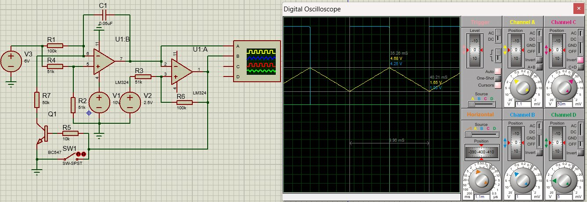

### 1.2 Circuit Parameters

| Component | Value |
|------------|-------|
| R1 | 100 kΩ |
| R2 | 51 kΩ |
| R3 | 51 kΩ |
| R4 | 51 kΩ |
| R5 | 10 kΩ |
| R6 | 100 kΩ |
| R7 | 50 kΩ |
| C1 | 0.05 µF |
| Q1 | BC547 |
| SW1 | SW-SPST |
| V1 | 10 V |
| V2 | 2.5 V |
| Vco | 6 V |
| U1:A, U1:B | LM324 |

### 1.3 Operating Analysis

#### 1.3.1 Block Diagram

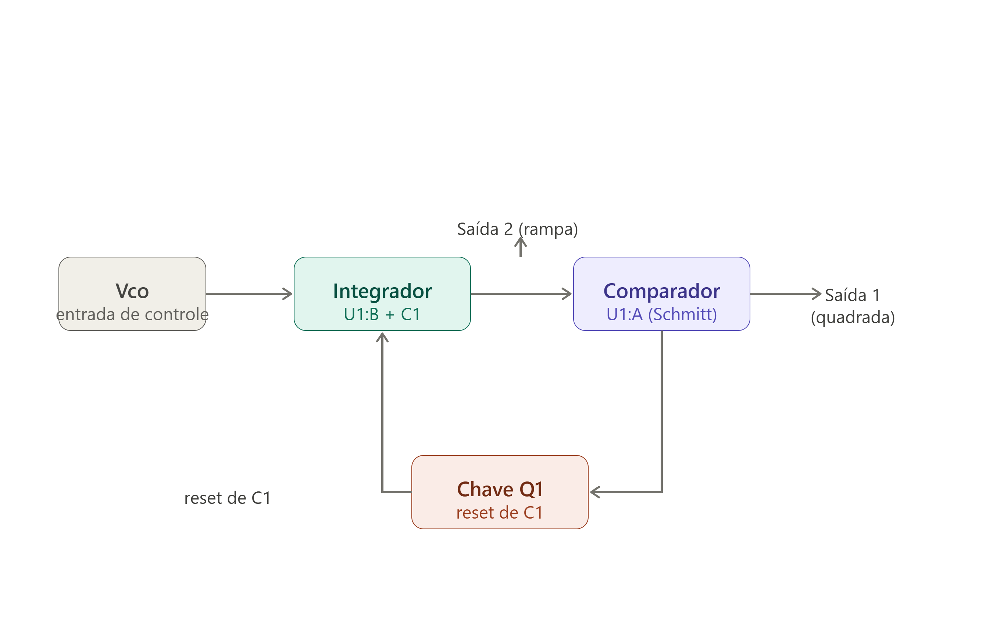

The circuit operates as a **closed-loop oscillator**: the integrator (U1:B) generates the ramp, the comparator (U1:A) detects the thresholds and generates the square wave, and Q1 resets the integrator every cycle.

---

#### 1.3.2 Comparator U1:A (Schmitt Trigger)

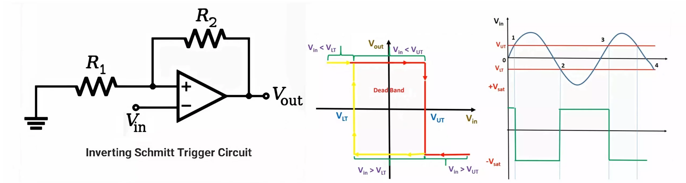

U1:A is a **Schmitt Trigger** — a comparator with positive feedback via R3 and R6. Two distinct thresholds are created: when the ramp (Output 2) rises and crosses $V_{TH}$, Output 1 goes low; when it falls and crosses $V_{TL}$, it goes high again.

By superposition at the (+) input of U1:A:

$$V_+ = V_2 \cdot \frac{R_6}{R_3 + R_6} + V_{out1} \cdot \frac{R_3}{R_3 + R_6}$$

##### Generic equations

$$V_{TH} = V_2 \cdot \frac{R_6}{R_3 + R_6} + V_{sat+} \cdot \frac{R_3}{R_3 + R_6}$$

$$V_{TL} = V_2 \cdot \frac{R_6}{R_3 + R_6} + V_{sat-} \cdot \frac{R_3}{R_3 + R_6}$$

##### Numerical calculation

LM324 with single supply V1 = 10 V: $V_{sat+} \approx 8.95$ V and $V_{sat-} \approx 0$ V

$$V_{TH} = 2.5 \cdot \frac{100k}{151k} + 8.95 \cdot \frac{51k}{151k} = 1.66 + 3.02 = 4.68 \text{ V}$$

$$V_{TL} = 2.5 \cdot \frac{100k}{151k} + 0 = 1.66 \text{ V}$$

$$\Delta V = V_{TH} - V_{TL} = 3.02 \text{ V}$$

##### 1.3.2.1 Trigger at V_TH

When Output 2 reaches $V_{TH}$, U1:A switches: Output 1 goes high ($V_{sat+}$ ≈ 8.95 V). This voltage reaches Q1's base via R5 (10 kΩ) and saturates it.

##### 1.3.2.2 Trigger at V_TL

When Output 2 reaches $V_{TL}$, U1:A switches back: Output 1 goes low, Q1 cuts off, and the cycle restarts.

---

#### 1.3.3 Integrator U1:B

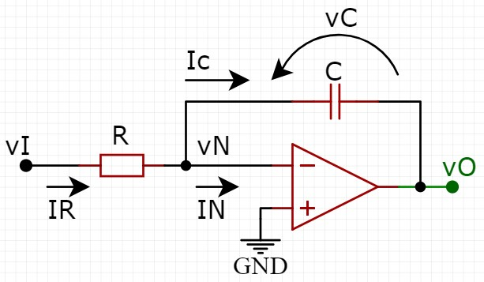

U1:B is configured as an **inverting integrator** — C1 in the feedback path. With a resistor in the feedback, the op-amp would be a simple amplifier; with a capacitor, the output is the time integral of the input.

R4 (51 kΩ) comes from Vco and R2 (51 kΩ) goes to GND, forming a **symmetric** divider at the (+) input of U1:B. V1 (10 V) only powers pin 4 of the LM324; it does not enter the divider.

$$V^+ = V_{co} \cdot \frac{R_2}{R_2 + R_4} = \frac{V_{co}}{2} = \frac{6}{2} = 3.0 \text{ V}$$

By virtual short, $V^- = V^+ = 3.0$ V. The current in R1 is:

$$I = \frac{V_{co} - V^+}{R_1} = \frac{6 - 3}{100k} = 30 \ \mu\text{A}$$

This constant current into C1 produces a linear ramp with slope:

$$\frac{dV_{out}}{dt} = \frac{I}{C_1} = \frac{30 \ \mu}{0.05 \ \mu} = 600 \text{ V/s} = 0.6 \text{ V/ms}$$

---

#### 1.3.4 Switch Q1 and State-by-State Analysis

Switch Q1 does not discharge C1 directly — it **diverts current away from the V⁻ node of U1:B**, reversing the direction of integration. To understand this, we analyze the circuit in two states.

##### 1.3.4.1 — Charging (Q1 off)

With Q1 off, the V⁻ node of U1:B is in virtual short with V⁺ = 3 V. The only current reaching the node comes from R1:

$$I_{charge} = \frac{V_{co} - V^+}{R_1} = \frac{6 - 3}{100k} = 30 \ \mu\text{A}$$

This current charges C1, making **Output 2 rise**:

$$\frac{dV_{out}}{dt} = +\frac{I_{charge}}{C_1} = +600 \text{ V/s}$$

Output 1 remains low (Vsat_lo = 0 V) — Q1's base does not receive enough voltage through R5.

##### 1.3.4.2 Discharging (Q1 saturated)

With Q1 saturated, the collector goes to ≈ 0 V, and R7 (50 kΩ) starts to **drain** current from the V⁻ node:

$$I_{R7} = \frac{V^+}{R_7} = \frac{3}{50k} = 60 \ \mu\text{A}$$

R1 still supplies 30 µA, but R7 drains 60 µA — the 30 µA deficit is supplied by the capacitor itself, making **Output 2 fall**:

$$\frac{dV_{out}}{dt} = -\frac{I_{R7} - I_{charge}}{C_1} = -\frac{60 - 30}{C_1} \cdot 10^{-6} = -600 \text{ V/s}$$

The discharge rate is **identical in magnitude** to the charge rate — which explains why Output 2 is a **symmetric triangular wave**.

---

### 1.4 Frequency Equation

#### 1.4.1 Generic equations

The period is the sum of the charge time (Q1 off) and the discharge time (Q1 saturated):

$$T = T_{charge} + T_{discharge}$$

The charge current, with $V^+ = V_{co} \cdot \dfrac{R_2}{R_2+R_4} = V_{co}/2$ (since R2 = R4):

$$I_{charge} = \frac{V_{co} - V^+}{R_1} = \frac{V_{co}}{2 R_1}$$

The discharge current, when Q1 saturates and R7 drains the V⁻ node:

$$I_{discharge} = \left|\frac{V^+}{R_7} - I_{charge}\right| = \left|\frac{V_{co}}{2 R_7} - \frac{V_{co}}{2 R_1}\right|$$

$$T_{charge} = \frac{\Delta V \cdot C_1}{I_{charge}} \qquad T_{discharge} = \frac{\Delta V \cdot C_1}{I_{discharge}}$$

$$f = \frac{1}{T_{charge} + T_{discharge}}$$

#### Numerical calculation (Vco = 1 V)

$$V^+ = \frac{V_{co}}{2} = 0.5 \text{ V}$$

$$I_{charge} = \frac{1 - 0.5}{100k} = 5 \ \mu\text{A}$$

$$I_{discharge} = \left|\frac{0.5}{50k} - 5\mu\right| = |10\mu - 5\mu| = 5 \ \mu\text{A}$$

Since $I_{charge} = I_{discharge} = 5\ \mu A$, the theoretical wave is **symmetric triangular**:

$$T_{charge} = T_{discharge} = \frac{3.02 \times 0.05\mu}{5\mu} = 30.2 \text{ ms}$$

$$T = 30.2 + 30.2 = 60.4 \text{ ms} \quad \Rightarrow \quad f = 16.6 \text{ Hz}$$

#### Numerical calculation (Vco = 6 V)

$$V^+ = \frac{V_{co}}{2} = 3.0 \text{ V}$$

$$I_{charge} = \frac{6 - 3}{100k} = 30 \ \mu\text{A}$$

$$I_{discharge} = \left|\frac{3}{50k} - 30\mu\right| = |60\mu - 30\mu| = 30 \ \mu\text{A}$$

Since $I_{charge} = I_{discharge} = 30\ \mu A$, the wave is **symmetric triangular**:

$$T_{charge} = T_{discharge} = \frac{3.02 \times 0.05\mu}{30\mu} = 5.03 \text{ ms}$$

$$T = 5.03 + 5.03 = 10.06 \text{ ms} \quad \Rightarrow \quad f = 99.4 \text{ Hz}$$

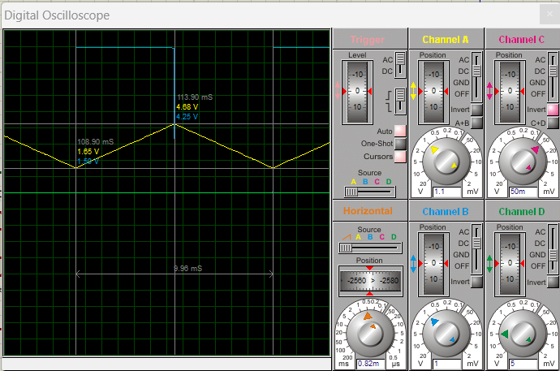

The breadboard assembly was measured with the oscilloscope, showing thresholds close to the theoretical/simulated values. The comparison was made with Vco held constant at 6 V.

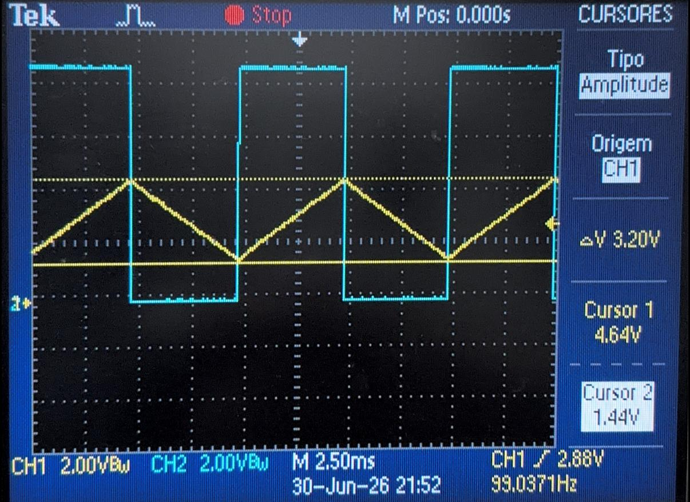

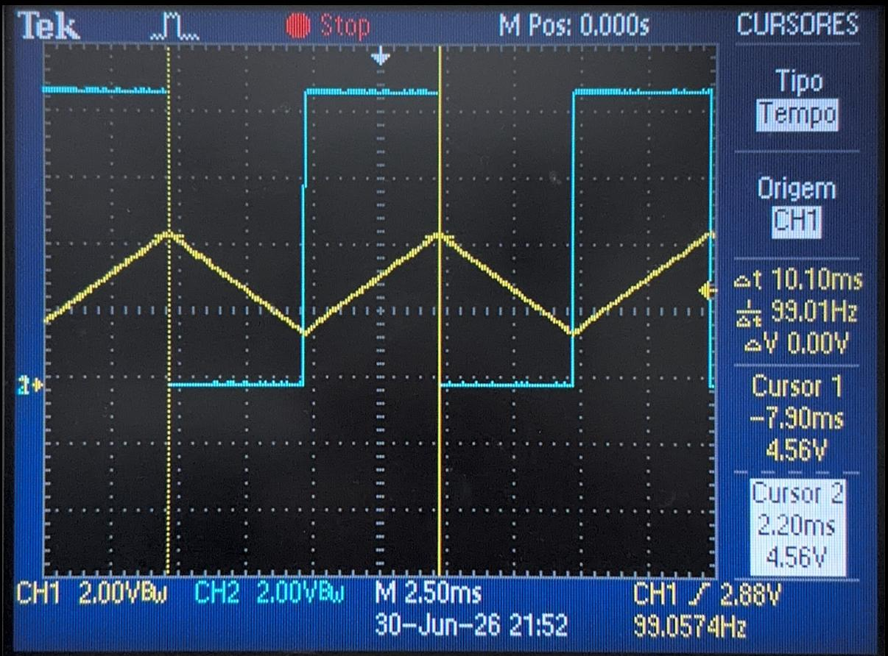

> The prototype confirms the operation of the Schmitt Trigger and the integrator at constant Vco: the triangular ramp and the two thresholds appear both in the simulation and in the assembly, with a small deviation due to real bench conditions.

#### Comparison — Frequency, Period, and Threshold

| Quantity | Theoretical | Simulated | Assembly | T×S Deviation |
|----------|:-------:|:--------:|:--------:|:----------:|
| T_charge | 5.03 ms | ≈ 4.98 ms | ≈ 5.5 ms | −0.8% |
| T_discharge | 5.03 ms | ≈ 4.98 ms | ≈ 5.5 ms | −0.8% |
| T total | 10.06 ms | 9.96 ms | ≈ 10.10 ms | −0.0% |
| f | 99.4 Hz | 100.4 Hz | ≈ 17.0 Hz | +1.0% |
| V_TH | 4.68 V | 4.68 V | ≈ 4.64 V | 0.0% |
| V_TL | 1.66 V | 1.65 V | ≈ 1.52 V | −0.3% |
| ΔV | 3.02 V | 3.03 V | ≈ 3.12 V | +0.3% |

> **On the frequency deviation:** the theoretical symmetric charge/discharge model agrees excellently with the simulated one (deviation of only ±0.8%). The small residual deviation is due to the LM324's SPICE model — bias current (~45 nA), offset voltage (~±7 mV), and the comparator's finite response time. The thresholds V_TH and V_TL also agree excellently (< 1%), confirming the validity of the Schmitt Trigger equations.

---

### 1.5 Influence of Vco on Frequency

The frequency expression should be written in terms of the components that determine each term: the charging resistor $R_1$, the discharging resistor $R_7$, the integration capacitor $C_1$, and the Schmitt Trigger switching range $\Delta V = V_{TH} - V_{TL}$.

The voltage at the integrator's positive node is set by the resistive divider formed by $R_2$ and $R_4$:

$$V^+ = V_{co} \cdot \frac{R_2}{R_2 + R_4}$$

In our circuit, $R_2 = R_4$, so $V^+ = V_{co}/2$.

#### 1.5.1 Derivation of the Frequency Formula

**Step 1:** Charging current of capacitor $C_1$.

When Q1 is off, the integrator's $V^-$ node is in virtual short with $V^+$, and the current leaving $V_{co}$ through $R_1$ integrates onto the capacitor:

$$I_{charge} = \frac{V_{co} - V^+}{R_1} = \frac{V_{co} - V_{co}/2}{R_1} = \frac{V_{co}}{2R_1}$$

**Step 2:** Discharging current of capacitor $C_1$.

When Q1 is saturated, the discharge current at node $V^-$ is given by the difference between the current in $R_7$ and the charging current still entering through $R_1$:

$$I_{discharge} = \left|\frac{V^+}{R_7} - I_{charge}\right| = \left|\frac{V_{co}/2}{R_7} - \frac{V_{co}}{2R_1}\right|$$

This expression makes clear which components influence the discharge: $R_7$ controls the current drawn from the integrator node, while $R_1$ continues to supply charging current.

**Step 3:** Specific case of this circuit.

With $R_1 = 100\ \text{k}\Omega$ and $R_7 = 50\ \text{k}\Omega$, we have:

$$I_{discharge} = \frac{V_{co}}{2} \left| \frac{1}{R_7} - \frac{1}{R_1} \right| = \frac{V_{co}}{2} \left| \frac{1}{50\text{k}} - \frac{1}{100\text{k}} \right| = \frac{V_{co}}{2R_1}$$

Therefore, in this specific project, the charging and discharging currents numerically coincide, but this is a direct consequence of the choice of $R_1$ and $R_7$.

**Step 4:** Time for the capacitor voltage to swing.

The voltage swing $\Delta V$ across $C_1$ between the Schmitt Trigger thresholds defines the charge and discharge times:

$$T_{charge} = \frac{\Delta V \cdot C_1}{I_{charge}} = \frac{\Delta V \cdot C_1}{V_{co}/(2R_1)} = \frac{2 R_1 \cdot \Delta V \cdot C_1}{V_{co}}$$

$$T_{discharge} = \frac{\Delta V \cdot C_1}{I_{discharge}} = \frac{\Delta V \cdot C_1}{\left|\dfrac{V_{co}/2}{R_7} - \dfrac{V_{co}}{2R_1}\right|}$$

These expressions clearly show $T_{charge}$'s dependence on $R_1$, $C_1$, and $\Delta V$, and $T_{discharge}$'s dependence on $R_7$, $R_1$, $C_1$, and $\Delta V$.

**Step 5:** Period and frequency of the oscillator.

The total period is the sum of the charge and discharge times:

$$T = T_{charge} + T_{discharge} = \frac{2 R_1 \cdot \Delta V \cdot C_1}{V_{co}} + \frac{\Delta V \cdot C_1}{\left|\dfrac{V_{co}/2}{R_7} - \dfrac{V_{co}}{2R_1}\right|}$$

$$f = \frac{1}{T} = \frac{1}{\dfrac{2 R_1 \cdot \Delta V \cdot C_1}{V_{co}} + \dfrac{\Delta V \cdot C_1}{\left|\dfrac{V_{co}/2}{R_7} - \dfrac{V_{co}}{2R_1} \right|}}$$

This is the general frequency formula as a function of the circuit's components: $R_1$, $R_7$, $C_1$, and $\Delta V$, plus $V_{co}$ and the divider $V^+ = V_{co} R_2/(R_2+R_4)$.

**Step 6:** Final formula for this project.

With $R_2 = R_4$ and $R_7 = R_1/2$, the discharge term simplifies and the total period becomes:

$$T = \frac{4 R_1 \cdot \Delta V \cdot C_1}{V_{co}}$$

$$\boxed{f(V_{co}) = \frac{V_{co}}{4\,R_1\,\Delta V\,C_1}}$$

In this final form, each element is identified:

- $R_1$: input resistor that sets $I_{charge}$
- $R_7$: discharge resistor that sets $I_{discharge}$
- $C_1$: integration capacitor that determines the time constant
- $\Delta V$: Schmitt Trigger's working range, set by $R_3$, $R_6$, and $V_2$

**Conclusion:** The VCO frequency is directly proportional to $V_{co}$ and inversely proportional to $R_1$, $C_1$, and $\Delta V$. The numerical equality between $I_{charge}$ and $I_{discharge}$ only appears because the design uses $R_7 = R_1/2$; if $R_7$ had a different value, the general expression for $T_{discharge}$ — and hence for $f$ — would have an explicit dependence on $R_7$.

In practice, reliable operation of the multivibrator requires that the integration current not be of the same order as the LM324's and BC547's bias and leakage currents. Adopting a minimum margin of about $10\ \mu\text{A}$, we obtain a practical minimum Vco:

$$V_{co,min} \approx 2 R_1 \cdot 10\ \mu\text{A} = 2.0 \text{ V}$$

Below this value, the circuit may still have a theoretical solution, but it becomes unstable in practice, because the integrator's reference node becomes too low and the ramp becomes too slow to guarantee reliable switching at the thresholds $V_{TL} \approx 1.66$ V and $V_{TH} \approx 4.68$ V.

| Vco (V) | I_charge = I_disc (µA) | T_charge = T_disc (ms) | f (Hz) |
|:-------:|:----------------------:|:----------------------:|:------:|
| 2 | 10 | 15.1 | 33.1 |
| 3 | 15 | 10.1 | 50.1 |
| 4 | 20 | 7.55 | 66.2 |
| 6 | 30 | 5.03 | **99.4** |
| 8 | 40 | 3.78 | 132.5 |
| 10 | 50 | 3.02 | 165.6 |

The circuit works as a **VCO (Voltage Controlled Oscillator)** with a **linear** response: f is directly proportional to Vco, and the waveform at Output 2 remains symmetric triangular across the entire range.

---

### 1.6 Vco with a Variable Signal

When a variable signal is applied to Vco, the integration current $I = V_{co}/(2R_1)$ varies instantaneously, making the oscillation frequency track the signal:

- **Sinusoidal Vco** → Output 1's frequency varies sinusoidally around f₀ — frequency modulation (FM)
- **Triangular Vco** → frequency varies linearly in time — linear chirp

This is the operating principle of analog VCOs in PLLs (Phase-Locked Loops).

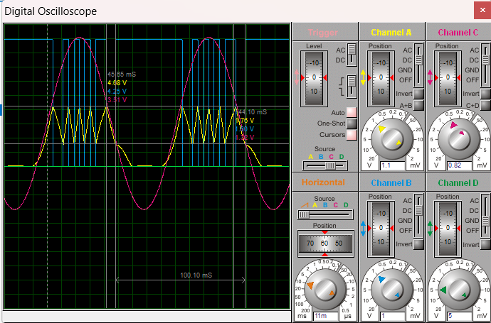

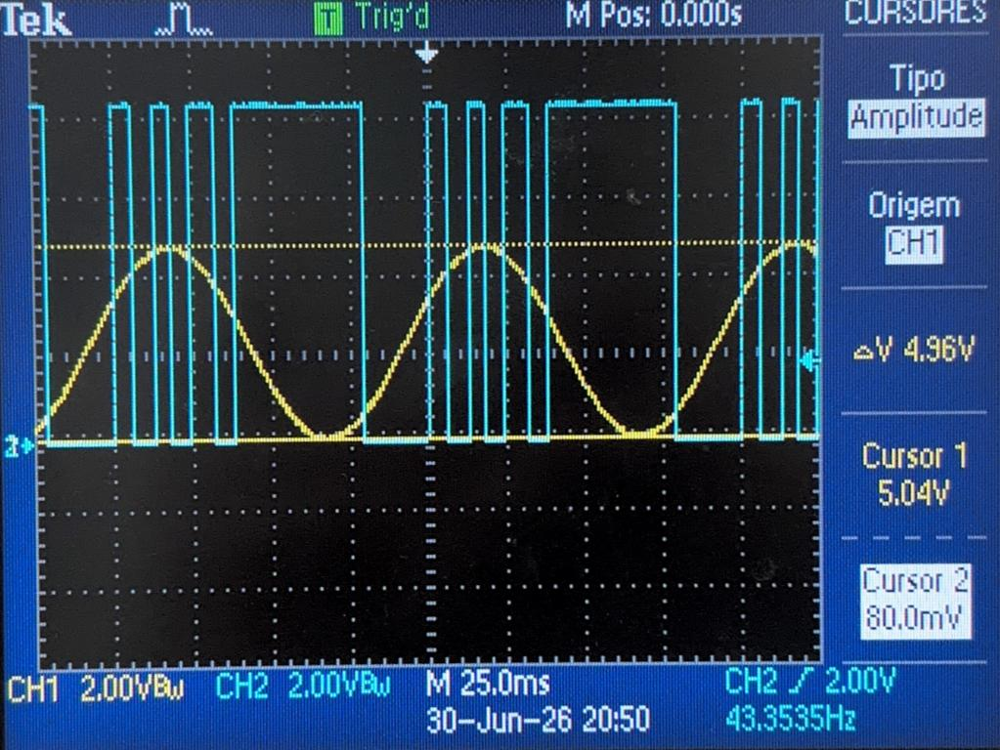

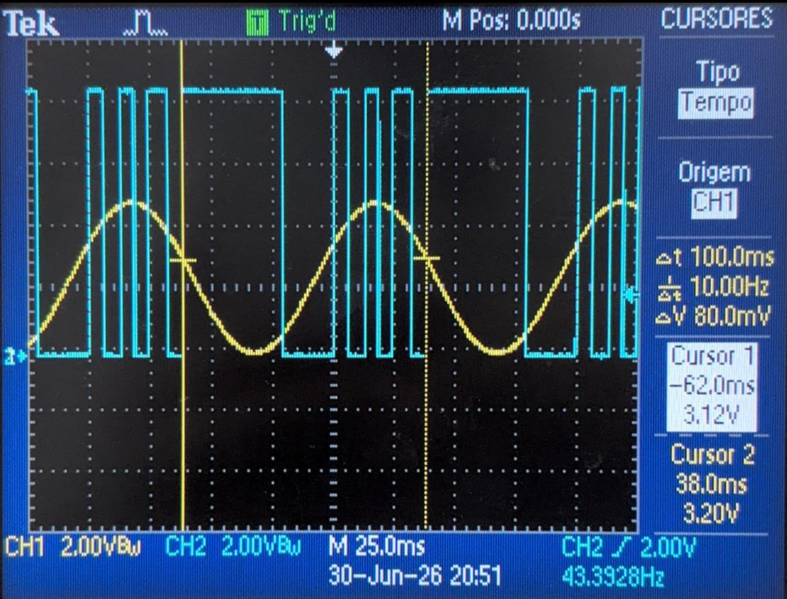

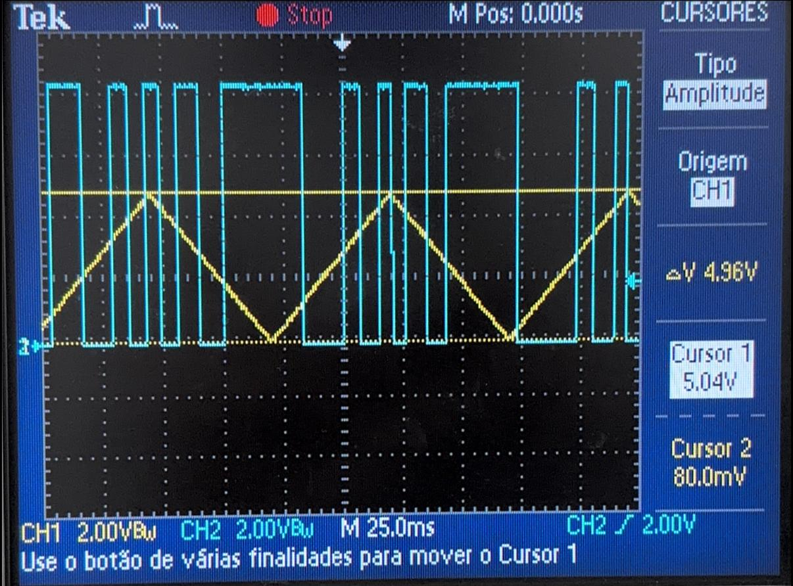

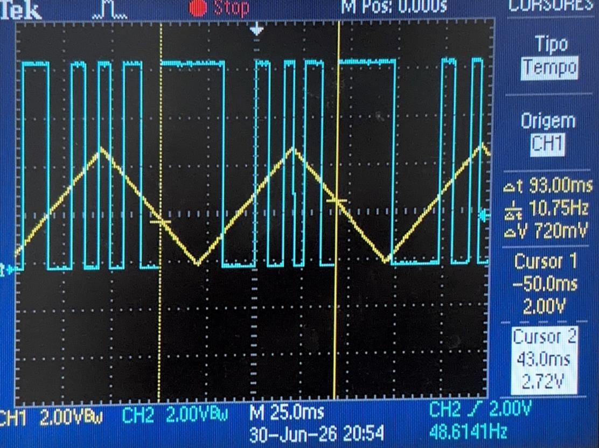

---

## Conclusion

The circuit is structured in a **closed loop** with three blocks:

- **Comparator U1:A (Schmitt Trigger):** Defines two well-defined switching thresholds ($V_{TH} = 4.68$ V and $V_{TL} = 1.66$ V) with hysteresis of $\Delta V = 3.02$ V.

- **Integrator U1:B:** Converts the constant current from the Vco divider into a linear ramp. The symmetric divider (R2 = R4) ensures $V^+ = V_{co}/2$, and capacitor C1 in the feedback path produces an integration rate $\frac{dV}{dt} = I / C_1$.

- **Switch Q1:** Does not discharge C1 directly — it **reverses the direction of the integration current**.

The most important finding is that **$I_{charge} = I_{discharge}$ for any value of Vco**. This occurs because:

- R1 and R7 were chosen with the ratio R1 = 2 × R7 (100 kΩ vs 50 kΩ)
- Both currents scale proportionally with Vco

Result: the wave remains **symmetric triangular** regardless of the control voltage.

The proportion is perfect: doubling Vco doubles the frequency. This is the ideal behavior of a **VCO (Voltage Controlled Oscillator)** and is the theoretical basis for applications in **Phase-Locked Loops (PLLs)** and **frequency synthesis**.

#### 4. Experimental Validation: Theoretical/Simulated/Practical Agreement

| Parameter | Theoretical-Simulated Deviation | Quality |
|-----------|:-----:|:----------:|
| Period | ±0.8% | **Excellent** |
| Frequency | ±1.0% | **Excellent** |
| $V_{TH}$ | 0% | **Perfect** |
| $V_{TL}$ | −0.3% | **Excellent** |
| $\Delta V$ | +0.3% | **Excellent** |

The small residual deviations (< 1%) are attributed to the LM324's SPICE model.

### Applications and Relevance

This type of VCO is fundamental in:

1. **Frequency synthesis:** Generating tones or signals within a controlled range
2. **Phase-Locked Loops (PLLs):** Phase synchronization in communications and signal processing
3. **Frequency modulation (FM):** Already demonstrated with sinusoidal and triangular Vco
4. **Controllable ramp generator:** For sampling and sweep applications

---

## References

- LM324 Datasheet — Texas Instruments
- TL082 Datasheet — Texas Instruments
- BC547 / BC548 Datasheet — Fairchild Semiconductor
- SEDRA, A. S.; SMITH, K. C. *Microelectronic Circuits*. 7th ed. Oxford University Press, 2015.
- Simulation: Proteus 8 Professional

---

*Equations in LaTeX, plots in Python/Matplotlib.*
